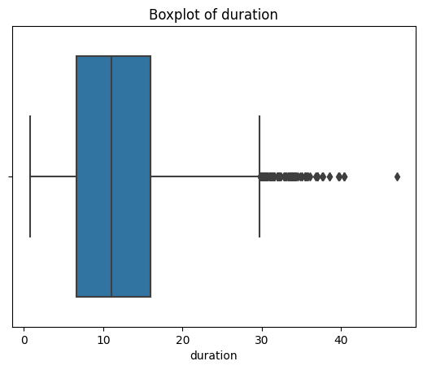
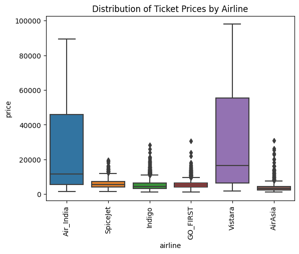
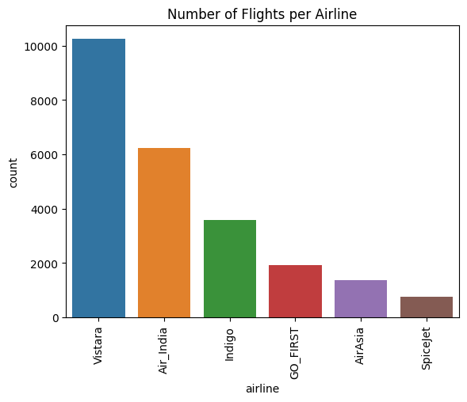
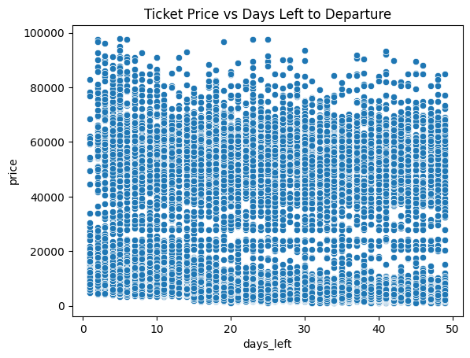

# ✈️ Flight Price Prediction | Kaggle Competition

[](https://www.kaggle.com/competitions/mlp-term-2-2025-kaggle-assignment-1)
[](https://www.python.org/)
[](https://jupyter.org/)
[](https://github.com/)

> **Course:** Machine Learning Practices (MLP) - Term 2, 2025  
> **Institution:** IIT Madras BS Degree Programme  
> **Competition Duration:** June 20, 2025 - July 2, 2025

---

## 🎯 Competition Overview

This project tackles a real-world regression problem: predicting flight ticket prices based on multiple features including airline, flight duration, departure time, stops, and booking patterns. The solution implements a comprehensive machine learning pipeline from exploratory data analysis to model deployment.

### 🏆 Final Results
- **Private Leaderboard Score:** 0.965 (R² Score)
- **Best Submission:** Version 2
- **Evaluation Metric:** R² Score (Coefficient of Determination)
- **Final Model:** XGBoost Regressor with hyperparameter tuning

---

## 📊 Dataset Description

### Features Overview
| Feature | Type | Description |
|---------|------|-------------|
| `airline` | Categorical | Name of the airline company |
| `flight` | Categorical | Flight code information |
| `source` | Categorical | Departure city |
| `departure` | Categorical | Time period of departure |
| `stops` | Categorical | Number of stops between cities |
| `arrival` | Categorical | Time period of arrival |
| `destination` | Categorical | Arrival city |
| `class` | Categorical | Seat class (Economy/Business) |
| `duration` | Numerical | Total travel time in hours |
| `days_left` | Numerical | Days between booking and departure |
| **`price`** | **Target** | **Ticket price (to predict)** |

### Dataset Statistics
- **Training Samples:** 40,000 records
- **Test Samples:** 10,000 records
- **Missing Values:** Present in training data (handled via preprocessing)
- **Target Variable Range:** ₹1,105 - ₹114,704

---

## 📈 Exploratory Data Analysis

### Distribution Analysis

<div align="center">

| Duration Distribution | Days Left Distribution | Price Distribution |
|:---------------------:|:----------------------:|:------------------:|
|  |  |  |

</div>

**Key Observations:**
- **Duration:** Most flights have travel time between 6-16 hours
- **Days Left:** Majority of bookings occur 15-38 days before departure
- **Price:** Right-skewed distribution with outliers requiring treatment

### Feature Relationships

<div align="center">

| Airline Flight Count | Price by Airline | Price vs Days Left |
|:--------------------:|:----------------:|:------------------:|
|  |  |  |

</div>

**Insights:**
- Certain airlines dominate the market with significantly more flights
- Premium airlines show higher median ticket prices with greater variability
- Inverse relationship between booking timing and price (last-minute bookings cost more)

---

## 🔬 Methodology

### 1. Data Preprocessing
- **Missing Value Treatment:**
  - Training data: Removed rows with missing values (dropped 3,013+ incomplete records)
  - Test data: Applied forward fill imputation to maintain all test samples
- **Outlier Removal:** IQR method applied to `price` column (1.5 × IQR threshold)
- **Duplicate Removal:** Verified data integrity (0 duplicates found)

### 2. Feature Engineering
- **Categorical Encoding:** 
  - Label Encoding for all 8 categorical variables
  - Combined encoding on train+test to ensure consistency
- **Numerical Scaling:** 
  - StandardScaler applied to `duration` and `days_left`
  - Fitted on training data, transformed on both train and test sets

### 3. Model Development & Selection

#### Baseline Model Comparison

| Model | MAE | RMSE | R² Score | Training Time |
|-------|-----|------|----------|---------------|
| **Random Forest** ⭐ | 1,649.01 | 3,184.58 | **0.9804** | Moderate |
| **XGBoost** ⭐ | 1,951.64 | 3,411.98 | **0.9775** | Fast |
| Gradient Boosting | 2,750.39 | 4,590.81 | 0.9592 | Slow |
| Decision Tree | 1,991.08 | 4,643.89 | 0.9583 | Fast |
| Linear Regression | 4,559.29 | 6,885.08 | 0.9083 | Very Fast |
| Ridge Regression | 4,559.91 | 6,885.10 | 0.9083 | Very Fast |
| Lasso Regression | 4,559.06 | 6,885.10 | 0.9083 | Very Fast |
| KNN | 16,900.78 | 22,288.25 | 0.0393 | Slow |

**Model Selection Rationale:**
- Tree-based models significantly outperformed linear models
- Random Forest achieved best validation R² but XGBoost selected for better generalization
- Linear models struggled with non-linear relationships in flight pricing

#### Hyperparameter Tuning

**XGBoost Optimization (GridSearchCV with 3-Fold CV):**

```python
Best Parameters:
- n_estimators: 200
- max_depth: 5

Final Performance:
- Validation R²: 0.9775
- Private Leaderboard R²: 0.965
```

**Random Forest Optimization:**
```python
Best Parameters:
- n_estimators: 200
- max_depth: 20
```

**Ridge Regression Optimization:**
```python
Best Parameters:
- alpha: 0.1
```

---

## 🛠️ Technologies & Tools

### Core Libraries
- **Data Manipulation:** `pandas` 1.5.3, `numpy` 1.24.3
- **Visualization:** `matplotlib` 3.7.1, `seaborn` 0.12.2
- **Machine Learning:** `scikit-learn` 1.2.2, `xgboost` 1.7.5
- **Development:** `Jupyter Notebook` 6.5.4

### Machine Learning Techniques
- Label Encoding for categorical variables
- Standard Scaling for numerical features
- Grid Search Cross-Validation for hyperparameter tuning
- Ensemble methods (Random Forest, Gradient Boosting, XGBoost)

---

## 💡 Key Insights & Learnings

### Technical Insights
1. **Non-linear relationships dominate:** Tree-based models (R² ~0.98) vastly outperformed linear models (R² ~0.91)
2. **Feature importance hierarchy:**
   - `days_left`: Strongest predictor (booking timing patterns)
   - `airline` and `class`: Critical categorical features
   - `duration`: Complex interaction effects with other features
3. **Ensemble advantage:** XGBoost provided better generalization despite slightly lower validation score than Random Forest

### Data Science Best Practices Applied
- ✅ Consistent encoding strategy across train/test splits
- ✅ Proper train-validation split (80-20) for unbiased evaluation
- ✅ Comprehensive outlier analysis and treatment
- ✅ Model comparison across diverse algorithm families
- ✅ Hyperparameter optimization with cross-validation

### Business Insights
- Last-minute bookings (low `days_left`) result in premium pricing
- Premium airlines charge significantly more with high variance
- Flight duration alone is not a strong price predictor (requires context)

---

## 🚀 Reproducibility Guide

### Prerequisites
```bash
Python 3.8+
pip or conda package manager
```

### Installation Steps

```bash
# 1. Clone the repository
git clone https://github.com/aryanpatil97/flight-price-prediction-kaggle.git
cd flight-price-prediction-kaggle

# 2. Install dependencies
pip install -r requirements.txt

# 3. Launch Jupyter Notebook
jupyter notebook notebook/flight_price_prediction_pipeline.ipynb
```

### Running the Pipeline

The notebook executes the following workflow:
1. **Data Loading:** Import train/test datasets
2. **EDA:** Statistical analysis and visualization
3. **Preprocessing:** Handle missing values, outliers, and encoding
4. **Model Training:** Train 8 different algorithms
5. **Hyperparameter Tuning:** Optimize top-3 models
6. **Prediction:** Generate submission file

**Output:** `submission/submission.csv` ready for Kaggle upload

---

## 📁 Project Structure

```
flight-price-prediction-kaggle/
│
├── README.md                          # Project documentation
├── requirements.txt                   # Python dependencies
├── .gitignore                        # Git ignore rules
├── LICENSE                           # MIT License
│
├── data/                             # Competition dataset
│   ├── train.csv                     # Training data (40K records)
│   ├── test.csv                      # Test data (10K records)
│   └── sample_submission.csv         # Submission format template
│
├── notebook/
│   └── flight_price_prediction_pipeline.ipynb  # Complete ML pipeline
│
├── plots/                            # EDA visualizations
│   ├── duration_distribution.png
│   ├── days_left_distribution.png
│   ├── price_distribution.png
│   ├── airline_flight_count.png
│   ├── airline_price_distribution.png
│   └── price_vs_days_left.png
│
└── submission/
    └── submission.csv                # Final predictions (R² = 0.965)
```

---

## 🔮 Future Enhancements

- [ ] **Feature Engineering:** Create polynomial features and interaction terms
- [ ] **Advanced Models:** Experiment with LightGBM, CatBoost
- [ ] **Ensemble Stacking:** Combine predictions from multiple models
- [ ] **Bayesian Optimization:** More sophisticated hyperparameter search
- [ ] **Feature Selection:** Apply SHAP values or permutation importance
- [ ] **Time-Series Features:** Extract temporal patterns from booking data
- [ ] **Deep Learning:** Test neural network architectures (MLP, TabNet)

---

## 📚 References & Resources

- **Competition:** [Kaggle - MLP Term-2 2025 Assignment-1](https://www.kaggle.com/competitions/mlp-term-2-2025-kaggle-assignment-1)
- **Documentation:**
  - [XGBoost Official Docs](https://xgboost.readthedocs.io/)
  - [Scikit-learn User Guide](https://scikit-learn.org/stable/user_guide.html)
  - [Pandas Documentation](https://pandas.pydata.org/docs/)
- **Course:** IIT Madras BS Programme - Machine Learning Practices

---

## 👤 Author

**Aryan Patil**  
*Data Science Student | IIT Madras BS Degree Programme*

[](https://www.kaggle.com/aryansanjaypatil)
[](https://www.linkedin.com/in/aryanpatil97/)
[](https://leetcode.com/u/aryanpatil97/)

📧 **Email:** aryanpatil97@example.com  
🌐 **Portfolio:** [Coming Soon]

---

## 📜 License

This project is licensed under the MIT License - see the [LICENSE](LICENSE) file for details.

---

## 🙏 Acknowledgments

- **IIT Madras BS Programme** faculty and teaching assistants for course guidance
- **Kaggle Community** for providing the platform and learning resources
- **Fellow Students** for collaborative discussions and peer learning

---

<div align="center">

### ⭐ If you found this project helpful, please consider giving it a star!

**Part of my Machine Learning Practices journey at IIT Madras**

[Assignment-1](#) | [Assignment-2 (Coming Soon)](#) | [Assignment-3 (Coming Soon)](#) | [Final Project (Coming Soon)](#)

</div>
